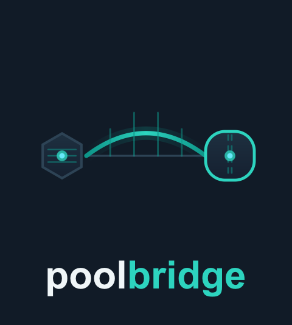

<div align="center">
  
</div>

**Convert Emlid Reach RTK survey data to Structure Studios Pool Studio DXF format.**

Poolbridge bridges the gap between modern GNSS field workflows and legacy pool
design software. Export a CSV from Emlid Flow, run one command or use the web
app, and open a fully layered DXF in Pool Studio (or AutoCAD / Vectorworks) in
seconds.

---

## Web App

The easiest way to use poolbridge — no installation required.

Upload your Emlid CSV, choose your coordinate system from the sidebar, enter
your control points, and download the DXF.

> **[Launch Poolbridge Web App →](https://share.streamlit.io)**
> *(deploy your own free instance — see [Deploying the Web App](#deploying-the-web-app) below)*

---

## Problem Statement

Pool designers need accurate site surveys — setbacks, house footprint, grade,
trees, utilities — before they can model a pool. RTK GNSS equipment like the
Emlid Reach RS2/RS3 delivers centimetre-level accuracy, but exports data in
WGS84 CSV format that Pool Studio cannot import. Poolbridge handles the
reprojection, coordinate localization, unit conversion, and layer structuring
so designers can focus on design, not data wrangling.

---

## Quick Start (CLI)

```bash
pip install poolbridge

# From any Emlid export format
poolbridge convert survey.csv -c config.yaml -o pool_site.dxf
poolbridge convert survey.kml  -c config.yaml -o pool_site.dxf
poolbridge convert survey.zip  -c config.yaml -o pool_site.dxf  # Shapefile in ZIP
poolbridge convert survey.dxf  -c config.yaml -o pool_site.dxf
```

Or in Python:

```python
from poolbridge import PoolBridgeConverter

converter = PoolBridgeConverter("config.yaml")
result = converter.convert("survey.csv", "pool_site.dxf")
print(result)
```

See [examples/](examples/) for a complete sample survey and config.

---

## Features

### Input Formats

All Emlid export formats are supported out of the box:

| Format | Extension | Notes |
|--------|-----------|-------|
| Emlid Flow CSV | `.csv` | Full-attribute export with BOM handling |
| PENZD CSV | `.csv` / `.txt` | Point/Easting/Northing/Z/Description |
| Google Earth KML | `.kml` | Extracts Placemark/Point features |
| Shapefile | `.zip` | ZIP archive containing `.shp`/`.dbf`/`.shx` |
| Emlid DXF | `.dxf` | Re-layers a bare Emlid point-dump DXF |

### Conversion Pipeline

- **Coordinate reprojection** — WGS84 → any UTM zone or US State Plane via pyproj
- **Origin-aware** — Emlid "Local" points (already projected) are never double-transformed
- **Two-point localization** — aligns survey to deed/design coordinates with a
  rigid-body transform (rotation + translation)
- **Helmert least-squares** — 3+ control points with residual reporting and RMS output
- **AIA NCS V6 layer structure** — V-BLDG, V-PROP, V-TOPO-SPOT, V-PLNT-TREE,
  V-UTIL-*, V-SURV-CTRL, V-EASEMENT, V-SETBACK, and more
- **Pool Studio DXF header** — `$INSUNITS=2` (decimal feet), `$MEASUREMENT=0` (imperial),
  `$PDMODE=35`, `$PDSIZE=0.5` set automatically
- **Smart features**:
  - Auto-draws drip-line circles for trees (`D=14'` in Description → CIRCLE)
  - Auto-connects property corners (PC-1…PC-4) and house corners (HC-1…HC-4)
    as closed polylines on V-PROP / V-BLDG
  - Auto-connects easement boundaries (EB-1…) on V-EASEMENT
  - Auto-connects setback boundaries (SB-1…) on V-SETBACK
  - Elevation callouts on grade shots (GR codes)
  - `FFE=` prefix labels on finished floor points
- **Contour generation** — interpolates GR shots with scipy + marching-squares to
  produce V-TOPO-MAJR / V-TOPO-MINR contour lines at user-defined intervals
- **YAML/JSON config** — map any custom survey code to a layer, color, and behaviour
- **Secondary PENZD CSV** export for stakeout re-import into Emlid Flow
- **Z datum control** — set project elevation zero from a named point (e.g. FFE)
  or apply a fixed offset
- **Streamlit web interface** — no-install browser UI for non-technical users

---

## Supported Coordinate Systems

The web app and CLI support all EPSG coordinate systems via pyproj. Common
presets in the web app dropdown:

| Region | Options |
|--------|---------|
| Texas | UTM 13N–15N, TX State Plane (all 5 zones) |
| Southeast | UTM 16N–18N, AL/MS/TN/NC/SC/VA/GA State Plane |
| Florida | FL State Plane East / West / North |
| Mid-Atlantic | UTM 18N–19N, NY/PA/NJ/MD/DE State Plane |
| New England | UTM 19N, MA/CT/RI/VT/NH/ME State Plane |
| Midwest | UTM 15N–16N, IL/IN/OH/MI/WI/MN/MO/KS State Plane |
| Mountain West | UTM 12N–13N, CO/AZ/NM/UT/NV/ID/MT/WY State Plane |
| Pacific Northwest | UTM 10N–11N, WA/OR State Plane |
| California | UTM 10N–11N, CA State Plane Zones I–VI |
| Any other | Custom EPSG code input |

---

## Installation

**Requirements:** Python 3.8+

```bash
pip install poolbridge
```

Or from source:

```bash
git clone https://github.com/rbm3267/poolbridge.git
cd poolbridge
pip install -e .
```

See [docs/setup.md](docs/setup.md) for dependency details and troubleshooting.

---

## Usage

### Web App

See [Deploying the Web App](#deploying-the-web-app) to get a shareable URL.

### CLI

```bash
# Basic conversion (no localization)
poolbridge convert survey.csv --crs EPSG:32614 --no-localize -o output.dxf

# With config file (recommended)
poolbridge convert survey.csv -c project.yaml -o pool_site.dxf

# Verbose output
poolbridge convert survey.csv -c project.yaml -o pool_site.dxf -v

# Override Z datum offset
poolbridge convert survey.csv -c project.yaml --z-offset -179.845 -o output.dxf
```

### Config File (YAML)

```yaml
coordinate_system:
  source_crs: "EPSG:4326"
  target_crs: "EPSG:32614"   # UTM Zone 14N (central Texas)

localization:
  method: "two_point"
  control_points:
    - name: "CP-1"
      known_easting: 0.0
      known_northing: 0.0
    - name: "CP-2"
      known_easting: 100.0
      known_northing: 0.0

z_datum:
  method: "point"
  reference_point: "FF-1"   # This point's elevation becomes 0.00

feature_codes:
  HC:
    layer: "V-BLDG"
    color: 7
    auto_connect: true
  PC:
    layer: "V-PROP"
    color: 1
    auto_connect: true
  GR:
    layer: "V-TOPO-SPOT"
    color: 4
    label_elevation: true
  TR:
    layer: "V-PLNT-TREE"
    color: 3
    draw_drip_circle: true
```

See [docs/config.md](docs/config.md) for the full reference.

---

## DXF Layer Structure

AIA NCS V6 layer naming, compatible with Pool Studio, AutoCAD, and Vectorworks:

| Layer | Color | Contents |
|-------|-------|----------|
| `V-NODE` | White | Generic survey points |
| `V-NODE-TEXT` | White | Point name labels |
| `V-PROP` | Red | Property boundary polyline + corners |
| `V-BLDG` | White | House footprint polyline + corners |
| `V-TOPO-SPOT` | Cyan | Grade shots with elevation text |
| `V-TOPO-MAJR` | Cyan | Major contours |
| `V-TOPO-MINR` | Cyan | Minor contours |
| `V-PLNT-TREE` | Green | Trees and drip-line circles |
| `V-UTIL-ELEC` | Yellow | Electrical |
| `V-UTIL-GAS` | Magenta | Gas |
| `V-UTIL-WATR` | Blue | Water |
| `V-UTIL-SEWR` | Green | Sewer / drainage |
| `V-SURV-CTRL` | Magenta | Control points and benchmarks |
| `V-EASEMENT` | Yellow | Easement reference lines |
| `V-SETBACK` | Yellow | Setback reference lines |

---

## Deploying the Web App

Poolbridge includes a Streamlit web interface (`app.py`) that non-technical
users can use without installing anything.

### Streamlit Community Cloud (free)

1. Go to **[share.streamlit.io](https://share.streamlit.io)** and sign in with GitHub
2. Click **New app**
3. Set **Repository** → `rbm3267/poolbridge`, **Branch** → `main`, **Main file** → `app.py`
4. Click **Deploy**

The app will install all dependencies automatically and give you a shareable
public URL. Apps on the free tier sleep after ~7 days of inactivity and wake
in a few seconds on next visit.

---

## Running Tests

```bash
pip install pytest scipy
pytest tests/ -v
# 131 passed
```

CI runs automatically on every pull request via GitHub Actions (Python 3.9, 3.11, 3.12).

---

## Documentation

| Document | Description |
|----------|-------------|
| [docs/setup.md](docs/setup.md) | Installation and requirements |
| [docs/workflow.md](docs/workflow.md) | End-to-end workflow guide |
| [docs/config.md](docs/config.md) | Complete config file reference |
| [docs/technical.md](docs/technical.md) | Pipeline internals, localization math, known limitations |

---

## Contributing

Contributions are welcome. Please open an issue before submitting a large pull request.

1. Fork the repository
2. Create a feature branch (`git checkout -b feature/my-feature`)
3. Write tests for your change
4. Open a pull request against `main`

---

## License

MIT License — see [LICENSE](LICENSE) for full text.

Copyright (c) 2026 Bennett Moore
